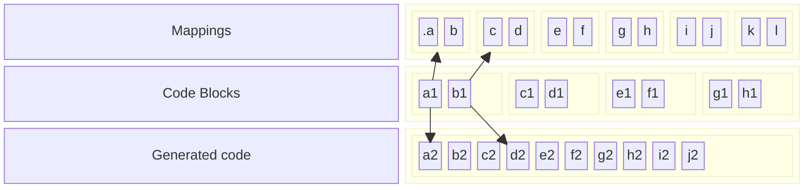

Redesign code generation strategy

In current implementation, whenever there's a need to generate synthetic types/members this is done `in line`, i.e, the code for the synthetic type/member is added in the middle of whatever were being processed. For instance:

```C#
// TestData.cs
using System;
class Foo
{
  void Bar()
  {
     Span<byte> b = new byte[] {1, 2, 3, 4, 5, 6, 7, 8};
  }
}
```

will generate something like:

```C#
//Class : Foo
var cls_Foo_0 = new TypeDefinition("", "Foo", TypeAttributes.AnsiClass | TypeAttributes.BeforeFieldInit | TypeAttributes.NotPublic, assembly.MainModule.TypeSystem.Object);
assembly.MainModule.Types.Add(cls_Foo_0);

//Method : Bar
var md_Bar_1 = new MethodDefinition("Bar", MethodAttributes.Private | MethodAttributes.HideBySig, assembly.MainModule.TypeSystem.Void);
cls_Foo_0.Methods.Add(md_Bar_1);
md_Bar_1.Body.InitLocals = true;
var il_Bar_2 = md_Bar_1.Body.GetILProcessor();

//Span<byte> b = new byte[] {1, 2, 3, 4, 5, 6, 7, 8};
var lv_b_3 = new VariableDefinition(assembly.MainModule.ImportReference(typeof(System.Span<>)).MakeGenericInstanceType(assembly.MainModule.TypeSystem.Byte));
md_Bar_1.Body.Variables.Add(lv_b_3);
il_Bar_2.Emit(OpCodes.Ldc_I4, 8);
il_Bar_2.Emit(OpCodes.Newarr, assembly.MainModule.TypeSystem.Byte);

/*
 * Synthetic type and members are generated in the middle of the method  
 */
//<PrivateImplementationDetails> class.
//This type is emitted by the compiler.
var cls_PrivateImplementationDetails_4 = new TypeDefinition("", "<PrivateImplementationDetails>", TypeAttributes.NotPublic | TypeAttributes.Sealed | TypeAttributes.AnsiClass | TypeAttributes.AutoLayout, assembly.MainModule.TypeSystem.Object);
assembly.MainModule.Types.Add(cls_PrivateImplementationDetails_4);
var fld_ArrayInitializerData_5 = new FieldDefinition("FB83FC0D7BB8E36B1D2A748F201745FB4E8A09FFA00BBA94F94BBB9C9497E55B", FieldAttributes.Assembly | FieldAttributes.Static | FieldAttributes.InitOnly, assembly.MainModule.TypeSystem.Int64);
cls_PrivateImplementationDetails_4.Fields.Add(fld_ArrayInitializerData_5);
fld_ArrayInitializerData_5.InitialValue = Cecilifier.Runtime.TypeHelpers.ToByteArray<Byte>(new Byte[] {1, 2, 3, 4, 5, 6, 7, 8});
il_Bar_2.Emit(OpCodes.Dup);
il_Bar_2.Emit(OpCodes.Ldtoken, fld_ArrayInitializerData_5);
il_Bar_2.Emit(OpCodes.Call, assembly.MainModule.ImportReference(TypeHelpers.ResolveMethod(typeof(System.Runtime.CompilerServices.RuntimeHelpers), "InitializeArray",System.Reflection.BindingFlags.Default|System.Reflection.BindingFlags.Static|System.Reflection.BindingFlags.Public, "System.Array", "System.RuntimeFieldHandle")));
il_Bar_2.Emit(OpCodes.Call, assembly.MainModule.ImportReference(TypeHelpers.ResolveMethod(typeof(System.Span<System.Byte>), "op_Implicit",System.Reflection.BindingFlags.Default|System.Reflection.BindingFlags.Static|System.Reflection.BindingFlags.Public, "System.Byte[]")));
il_Bar_2.Emit(OpCodes.Stloc, lv_b_3);
il_Bar_2.Emit(OpCodes.Ret);
```

ideally the synthetic type and members should be generated preceding the definition of the current type, i.e, the output should be something like:

```C#
/*
 * Synthetic type and members should be generated here.
 */
//<PrivateImplementationDetails> class.
//This type is emitted by the compiler.
var cls_PrivateImplementationDetails_4 = new TypeDefinition("", "<PrivateImplementationDetails>", TypeAttributes.NotPublic | TypeAttributes.Sealed | TypeAttributes.AnsiClass | TypeAttributes.AutoLayout, assembly.MainModule.TypeSystem.Object);
assembly.MainModule.Types.Add(cls_PrivateImplementationDetails_4);
var fld_ArrayInitializerData_5 = new FieldDefinition("FB83FC0D7BB8E36B1D2A748F201745FB4E8A09FFA00BBA94F94BBB9C9497E55B", FieldAttributes.Assembly | FieldAttributes.Static | FieldAttributes.InitOnly, assembly.MainModule.TypeSystem.Int64);
cls_PrivateImplementationDetails_4.Fields.Add(fld_ArrayInitializerData_5);
fld_ArrayInitializerData_5.InitialValue = Cecilifier.Runtime.TypeHelpers.ToByteArray<Byte>(new Byte[] {1, 2, 3, 4, 5, 6, 7, 8});

//Class : Foo
var cls_Foo_0 = new TypeDefinition("", "Foo", TypeAttributes.AnsiClass | TypeAttributes.BeforeFieldInit | TypeAttributes.NotPublic, assembly.MainModule.TypeSystem.Object);
assembly.MainModule.Types.Add(cls_Foo_0);

//Method : Bar
var md_Bar_1 = new MethodDefinition("Bar", MethodAttributes.Private | MethodAttributes.HideBySig, assembly.MainModule.TypeSystem.Void);
cls_Foo_0.Methods.Add(md_Bar_1);
md_Bar_1.Body.InitLocals = true;
var il_Bar_2 = md_Bar_1.Body.GetILProcessor();

//Span<byte> b = new byte[] {1, 2, 3, 4, 5, 6, 7, 8};
var lv_b_3 = new VariableDefinition(assembly.MainModule.ImportReference(typeof(System.Span<>)).MakeGenericInstanceType(assembly.MainModule.TypeSystem.Byte));
md_Bar_1.Body.Variables.Add(lv_b_3);
il_Bar_2.Emit(OpCodes.Ldc_I4, 8);
il_Bar_2.Emit(OpCodes.Newarr, assembly.MainModule.TypeSystem.Byte);
il_Bar_2.Emit(OpCodes.Dup);
il_Bar_2.Emit(OpCodes.Ldtoken, fld_ArrayInitializerData_5);
il_Bar_2.Emit(OpCodes.Call, assembly.MainModule.ImportReference(TypeHelpers.ResolveMethod(typeof(System.Runtime.CompilerServices.RuntimeHelpers), "InitializeArray",System.Reflection.BindingFlags.Default|System.Reflection.BindingFlags.Static|System.Reflection.BindingFlags.Public, "System.Array", "System.RuntimeFieldHandle")));
il_Bar_2.Emit(OpCodes.Call, assembly.MainModule.ImportReference(TypeHelpers.ResolveMethod(typeof(System.Span<System.Byte>), "op_Implicit",System.Reflection.BindingFlags.Default|System.Reflection.BindingFlags.Static|System.Reflection.BindingFlags.Public, "System.Byte[]")));
il_Bar_2.Emit(OpCodes.Stloc, lv_b_3);
il_Bar_2.Emit(OpCodes.Ret);
```

making it easier to understand the generated code for method `Bar` and the synthetic type and members.

Below we present 2 possible alternatives to achieve this:
1. Split the code generation into multiple phases, and generate synthetic types/members in an earlier phase, ensuring its code will have a higher chance of being declared before the first reference to it.
2. Introduce a concept of `code block` representing blocks of code for types/members and inserting these `code blocks` into the `right` position (it may even be possible to move those blocks around).

I'm inclined to go with option 2, as it seems to be simpler to implement and maintain.

The idea is to represent code blocks as a linked list where each node stores references to the first/last line in the generated code.

```C#
class CodeBlock
{
    LinkedListNode<string> FirstLine { get; }
    LinkedListNode<string> LastLine { get; }
    //CodeBlock Parent { get; }
    CodeBlock Previous { get; }
    LinkedListNode<string> InsertionPoint { get; }
    BlockKind Kind { get; }
}

enum BlockKind
{
    Type,
    Member,
    // Others ?

}
```

The code generation would keep a stack of such code blocks, and whenever it is going to start emitting code for a new type/member:

1. Check the top of stack. 
2. If it is empty or the top of stack is `insertion compatible` with the current type/member, simply add keep
   adding new lines to the generated code, as normal.
3. otherwise, follow the list of code blocks (starting with the top of the stack) until a compatible one is found.
4. Take the `FirstLine` of the code block found in step 3 as the `InsertionPoint`.
5. Instantiate and push a new code block for the current type/member setting the `InsertionPoint` to the value found in step 4.

So given the code above (`TestData.cs`), the algorithm would go as:
1. Visit the `compilation unit`
1. Visit the type declaration `class Foo` and push a code block for it (`InsertionPoint` set to `null` as there's no previous code block)
1. Various calls happens to generate code for type `Foo` appending the generated code to the existing list of instructions.
1. Visit the method `Bar` and push a code block for it (`InsertionPoint` set to the `null` also, as adding members to a type is `insertion compatible` operation)
1. Various calls happens to generate code for method `Bar` simply appending the generated code to the existing list of instructions.
1. While visiting `Span<byte> b = new byte[] {1, 2, 3, 4, 5, 6, 7, 8};` the need for a synthetic type/field appears (`PrivateImplementationDetails`).
1. Check the top of the stack (method `Bar`) and find that it is not `insertion compatible` with a `type` (methods cannot have types declared inside them) 
1. Get the code block previous to the one for the `Bar` method, i.e, the one for the type `Foo`.
1. Find that that block is `insertion compatible` with a `type` and would use its `FirstLine` as the `InsertionPoint` for the new code block.
1. Instantiate and push a new code block for the synthetic type.
1. When adding new generated code lines, these lines would be inserted before the `InsertionPoint` of the current code block, i.e, before the first line of `Foo`.
1. After adding some generated code, there's a need to add a field to the class we are emitting;
1. Check the top of the stack (type `PrivateImplementationDetails`) and find that it is compatible with a `field`
1. Instantiate and push a new code block for the synthetic field (`InsertionPoint` is the same as the `InsertionPoint` for the valid code block found in the previous step).
1. Code generation for the synthetic field finishes: pop the top of the stack. Now code block for `PrivateImplementationDetails` is the top of the stack
1. Any new synthetic members added to this type would be added to the end of the previous added one.
1. Code generation for `PrivateImplementationDetails` type finishes: pop the top of the stack. Now code block for `Bar` is the top of the stack
1. Code generation for `Bar` resumes appending new generated lines to the end of list (`Bar.InsertionPoint = null`)
1. Code generation for `Bar` finishes: pop the top of the stack. Now code block for `Foo` is the top of the stack
1. Code generation for `Foo` resumes appending new generated lines to the end of list (`Foo.InsertionPoint = null`)

This approach would make the generated code more predictable and easier to understand as it would be more linear.

The downside of this approach is that the actual mapping from `original source` -> `cecilified code` is done when each new line is added and assumes the lines does not move after that. One possible fix for that could be:
1.  Keep track of first/last entry in the mapping array for each code block
1.  Store line number relative to the beginning of the code the map is part of.
1.  After finishing the code generation, take the first code block and compute its last line number (just iterate over all the lines from `first` to `last` and add the number of `\n`)
1.  Take the value from the previous step and add it to all line numbers for the mappings linked to the `next` code block.
1.  During the previous step, accumulate the # of lines added by that block and use it as the offset to start step 4 now with the `next` code block
1.  repeat steps 4 ~ 6 until there is no more code blocks.



