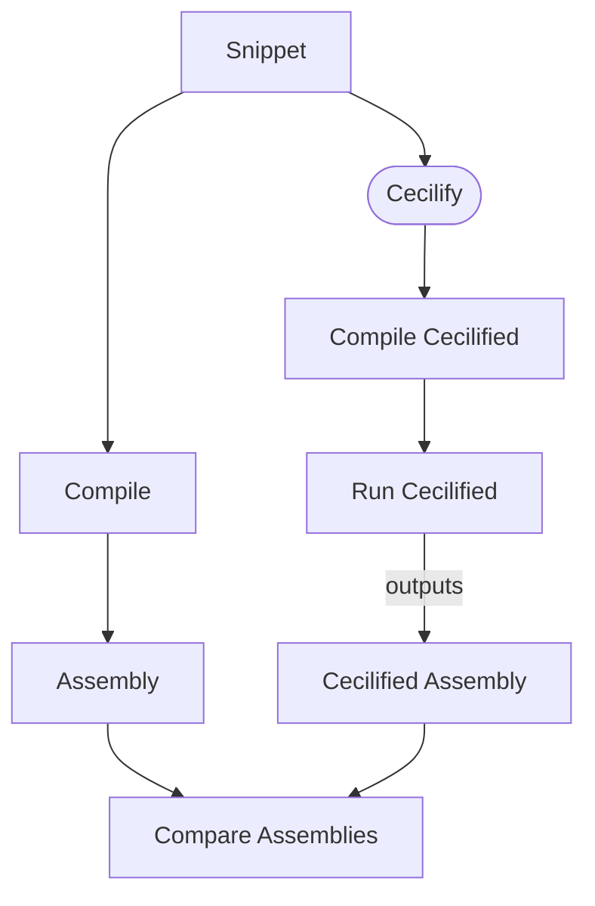

Cecilifier
====

About
---
Cecilifier is a tool meant to make it easier to learn how to use [Mono.Cecil](https://github.com/jbevain/cecil) a library used to manipulate MS IL. It was developed after the idea of [asmifier](https://asm.ow2.io/faq.html#Q10). You can read more details about it in its [announcement blog](https://programing-fun.blogspot.com/2019/02/making-it-easier-to-getting-started.html).

You can use it live in [this site](https://cecilifier.me/).

Feel free to send comments, issues, PR, etc; I cannot promise I'll be responsive but I'll do my best.

How to help
---
- Using it
- Finding issues
- [Fixing issues](https://github.com/adrianoc/cecilifier/issues)
- [Improving tests](#how-to-add-tests)
- Improving documentation
- Adding features
- Sending feedback
- Consider donating to the project through [github sponsorship](https://github.com/sponsors/adrianoc)

License
---
Cecilifier is licensed under [MIT license](license.md).

Supported Features
---- 
- Attribute declaration / usage
- Type declaration
	- Class
	- Struct
	- Enum
	- Interfaces
-  Member  declaration
	- Properties
	- Indexers
	- Methods
	- Fields
- Exception handling

- Single dimensional arrays
- Static generic methods

- Generics 
	- Type / method instantiation
    - Type / Method definition
    - Generic events
    - Constraints
    - Co/Contra variance
- Pointer types (int*, void*, etc)
- Fixed statement
- for statment
- Cast operator
- Non-capturing lambdas(converting to Func<>/Action<>)
     
Unsupported Features
---
- Events (wip, support most common cases)
- default expression
- Enumerator methods
- Delegate (generic)
- async/await
- Newer C# syntax (elvis operator, static import, to name some)
- Much more :(

How to use it
---

- The easiest way is to [browse to its site](https://cecilifier.me/).
- Another alternative is to build and run it  locally (see bellow)

Orthogonal to these options, after you Cecilifier some code you can create a project and debug the generated code to get more insight about how Mono.Cecil works.

How To build
---
In order to build it you need at least .Net Core SDK 5.0

- Pull the [git repo](https://github.com/adrianoc/cecilifier)
- Open a console in the folder with the pulled source code
- run dotnet build

You can run the website locally by typing:

> `cd Cecilifier.Web`

> `dotnet run`

Then you can open a browser at `http://localhost:5000`
(notice that https will not work locally)

How to add tests
===
First, and most importantly, tests should be self contained, clearly describing what they are testing and run quickly (unfortunately it is very likely that some of the existing tests does not meet this criteria, but nevertheless, we should strive to ;)

There are basically 2 types of tests ...

Unit Tests
---

These resembles tradicional Unit tests, at least from performance characteristics. They can be found [in this folder](Cecilifier.Core.Tests/Tests/Unit) and work by cecilifying some code and asserting the cecilified code for expected patterns.

- Pros
	- Performance: since there's no compilation involved these tests are much faster than the [Integration](#integration-tests) ones.
	- Easier to debug/investigate issues.
- Cons
	- Sensitive to changes in the way code is generated leading to false positives when naming rules, formating, etc. changes.
	- Sensitive to false positives due to, in general, not verifying all the generated code (which would be impratical)	- 

Integration Tests
---

These tests work basically taking a [snippet of code](https://github.com/adrianoc/cecilifier/blob/dev/Cecilifier.Core.Tests/TestResources/Integration/CodeBlock/Conditional/IfStatement.cs.txt), _Cecilifying_ it (generating the Mono.Cecil API calls to produce an assembly equivalent to the compiled snippet), compiling it,  and finally either comparing the two assemblies or comparing the generated IL for some method with the expected output [as in this example](https://github.com/adrianoc/cecilifier/blob/dev/Cecilifier.Core.Tests/TestResources/Integration/CodeBlock/Conditional/IfStatement.cs.il.txt). 

Ideally all tests in this category should use the assembly comparison approach (as opposed to forcing 
developers to store the expected IL) but in some cases the comparison code would became too complex and in such cases I think it is ok to store the expected IL (anyway, I try to minimize the number of such tests).

- Pros
	- In general, less prone to false positives
	- Easier to write (just write the C# snipet you want to cecilify and the framework will do the rest)
- Cons
	- Slower than Unit Tests above: verification requires cecilified code to be compiled and executed which has a big performance impact.
	- Verification depends on custom code that compares assemblies; this code is not straighforward and is prone to bugs
	- Harder to reason about failures.
	- Prone to false negatives due to differences in the compiler generated IL and cecilifier generated IL.

How to report issues
---

If you hit a problem and you think it is an issue/bug in the code please follow the steps to report it:

- Search in the open/resolved issues to make sure it is not already known
- If you cannot find anything, open a new issue and do your best to:
	- add a failing test (see [`How to add tests`](#how-to-add-tests)) or a snippet that will trigger the error
	- Make the title/description as clear / detailed as possible (do not assume anything; add as much details as possible)

Including a failing test/snippet is the best way to ensure the processing of the issue will happen as quick as possible and avoid any unnecessary delays.

Community
---

If you have any questions, suggestions or comments, feel free to join our discord channel at https://discord.gg/7P2sCk9 (I cannot guarantee that I'll be responsive but I'll do my best).

You can also reach me through Mastodon [@adrianoverona](https://fosstodon.org/@adrianoverona)

Build Status
---

Potential improvements
---

Disclaimer(s)
---

- TL;DR; Use at your own :)
- I am not a web designer/developer, so keep your expectations low (regarding the web site)
- I do not claim to be an expert in Mono.Cecil; the code certainly does not handle a lot of cases
- I do not claim that the generated code is suitable or even correct - I do have tests though :)
- Even though I do some code cleanup there are still some code duplication

Thanks
---

I'd like to thank JetBrains for donating me a [Rider](https://www.jetbrains.com/rider/) license.
